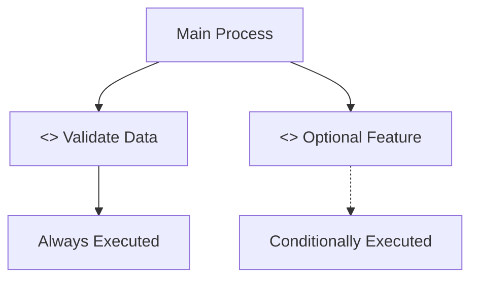

# Activity Diagram Symbols and Alignment Guide

## 📊 **Activity Diagram Symbols**

### **1. Basic Flow Symbols**

| Symbol | Name | Usage | Mermaid Syntax | PlantUML Syntax |
|--------|------|-------|----------------|-----------------|
| `[Start]` | Start Node | Beginning of process | `Start([Start])` | `start` |
| `[End]` | End Node | End of process | `End([End])` | `stop` |
| `[Action]` | Action/Activity | Process step | `Action[Action Name]` | `:Action Name;` |
| `{Decision}` | Decision Diamond | Conditional branching | `Decision{Question?}` | `if (condition?) then (yes)` |
| `[Parallel]` | Parallel Processing | Concurrent activities | `Parallel[Parallel Action]` | `fork` / `end fork` |

### **2. Swimlane Symbols**

| Symbol | Name | Usage | Mermaid Syntax | PlantUML Syntax |
|--------|------|-------|----------------|-----------------|
| `|User|` | User Swimlane | User actions | `subgraph "User"` | `\|User\|` |
| `|System|` | System Swimlane | System processes | `subgraph "System"` | `\|System\|` |
| `|Database|` | Database Swimlane | Database operations | `subgraph "Database"` | `\|Database\|` |

### **3. Include/Extend Symbols**

| Symbol | Name | Usage | Mermaid Syntax | PlantUML Syntax |
|--------|------|-------|----------------|-----------------|
| `<<include>>` | Include Relationship | Always executed | `Include[<<include>> Process]` | `note right: Include: Process` |
| `<<extend>>` | Extend Relationship | Conditionally executed | `Extend[<<extend>> Process]` | `note right: Extend: Process` |

### **4. Error Handling Symbols**

| Symbol | Name | Usage | Mermaid Syntax | PlantUML Syntax |
|--------|------|-------|----------------|-----------------|
| `[Error]` | Error Node | Error handling | `Error[Error Message]` | `:Error Message;` |
| `[Validation]` | Validation Node | Data validation | `Validation[Validate Data]` | `:Validate Data;` |

---

## 🎯 **Alignment Guidelines**

### **1. Horizontal Alignment (Left to Right)**

```
Start → Action1 → Action2 → Decision → Action3 → End
```

**Rules:**
- **Start** always on the left
- **End** always on the right
- **Actions** flow left to right
- **Decisions** in the middle of flow
- **Parallel processes** can be side by side

### **2. Vertical Alignment (Top to Bottom)**

```
Start
  ↓
Action1
  ↓
Decision
  ↓
Action2
  ↓
End
```

**Rules:**
- **Start** at the top
- **End** at the bottom
- **Actions** flow top to bottom
- **Decisions** create branching paths
- **Swimlanes** are horizontal sections

### **3. Swimlane Alignment**

```
┌─────────────────────────────────────┐
│ User Actions                        │
│ Start → Action1 → Action2 → End     │
└─────────────────────────────────────┘
┌─────────────────────────────────────┐
│ System Processes                    │
│ Process1 → Process2 → Process3      │
└─────────────────────────────────────┘
┌─────────────────────────────────────┐
│ Database Operations                 │
│ Query → Update → Save               │
└─────────────────────────────────────┘
```

---

## 📋 **Complete Symbol Reference for iWellCare System**

### **1. Authentication Process Symbols**


**Symbols Used:**
- `([Start])` - Start node
- `[Action]` - Action nodes
- `{Decision}` - Decision diamond
- `([End])` - End node
- `-->` - Flow arrows
- `-->|Label|` - Labeled flow arrows

### **2. Appointment Booking Process Symbols**


**Symbols Used:**
- **Decision Diamonds**: `{Question?}` for all conditional checks
- **Action Rectangles**: `[Action Name]` for all process steps
- **Flow Arrows**: `-->` for normal flow, `-->|Label|` for conditional flow
- **Error Handling**: Separate paths for error conditions

### **3. Include/Extend Relationship Symbols**



**Symbols Used:**
- `<<include>>` - Include relationship (always executed)
- `<<extend>>` - Extend relationship (conditionally executed)
- `-.->` - Dotted line for extend relationships

---

## 🎨 **Styling and Color Coding**

### **1. Color Scheme for Different Elements**


### **2. Swimlane Styling**


---

## 📐 **Alignment Rules for iWellCare System**

### **1. Process Flow Alignment**

```
Authentication Process:
Start → Login → Validate → Check Role → Redirect → End

Appointment Process:
Start → Check Auth → Check Role → Show Form → Select Doctor → 
Validate → Create → Set Status → End

Consultation Process:
Start → Select Patient → Load History → Enter Data → 
Record Vitals → Make Diagnosis → Create Prescription → End
```

### **2. Error Handling Alignment**

```
Main Flow:
Action1 → Action2 → Action3 → End

Error Flow:
Action1 → Action2 → Validation{Valid?}
Validation -->|Yes| Action3
Validation -->|No| Error[Show Error] → Action2
```

### **3. Include/Extend Alignment**

```
Main Process:
Action1 → Action2 → Action3 → End

Include Processes (Always):
Action2 → Include1[Validate Data]
Action2 → Include2[Check Permissions]

Extend Processes (Optional):
Action3 -.-> Extend1[Export Data]
Action3 -.-> Extend2[Send Notification]
```

---

## 🔧 **Implementation Guidelines**

### **1. Symbol Placement Rules**

1. **Start Node**: Always at the top-left
2. **End Node**: Always at the bottom-right
3. **Decision Diamonds**: In the middle of flow paths
4. **Action Rectangles**: Between start and end
5. **Error Nodes**: On separate paths from main flow
6. **Include Nodes**: Connected with solid lines
7. **Extend Nodes**: Connected with dotted lines

### **2. Flow Direction Rules**

1. **Primary Flow**: Left to right, top to bottom
2. **Error Flows**: Can go backward or to separate paths
3. **Parallel Flows**: Side by side or in separate swimlanes
4. **Include Flows**: Always forward from main process
5. **Extend Flows**: Can branch off main process

### **3. Labeling Rules**

1. **Decision Labels**: Use clear yes/no questions
2. **Action Labels**: Use verb-noun format (e.g., "Create Appointment")
3. **Flow Labels**: Use descriptive text for conditional flows
4. **Error Labels**: Use clear error descriptions
5. **Include Labels**: Use "<<include>>" prefix
6. **Extend Labels**: Use "<<extend>>" prefix

This guide provides all the symbols and alignment rules needed to create proper activity diagrams for the iWellCare Healthcare Management System based on the actual system processes.
