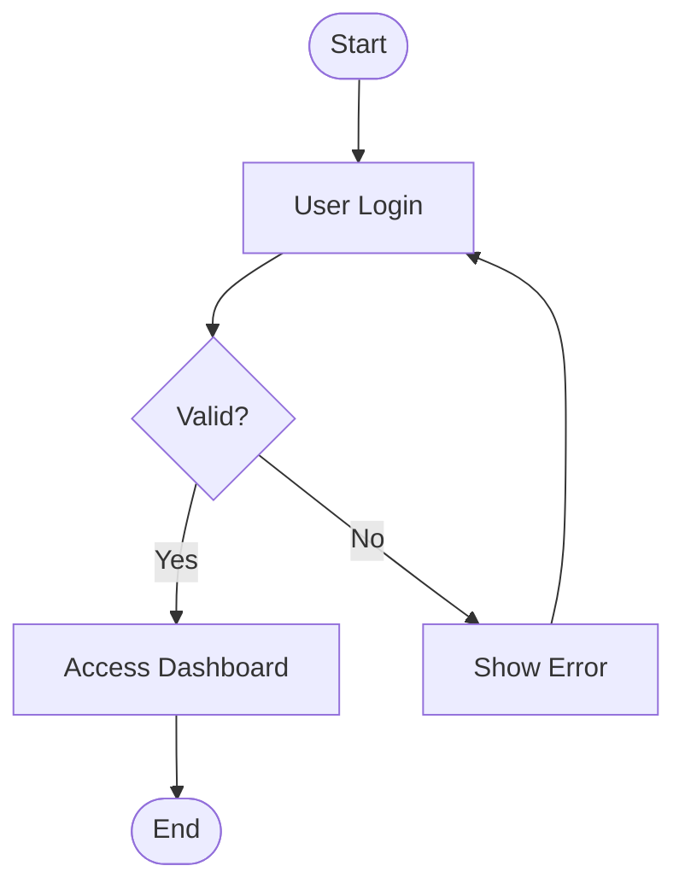
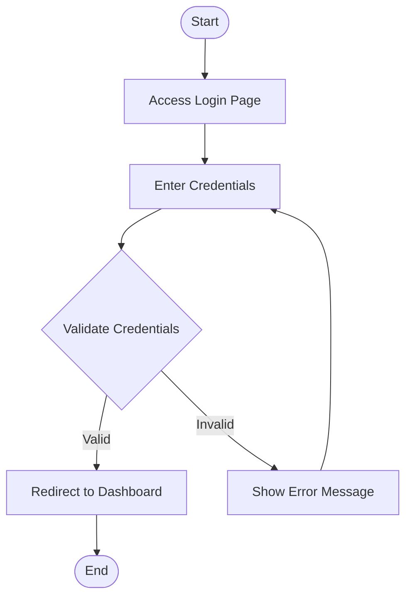
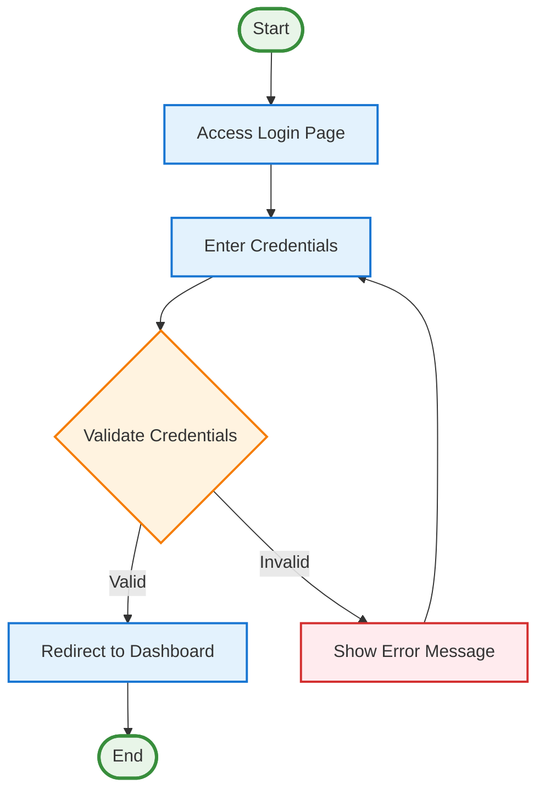
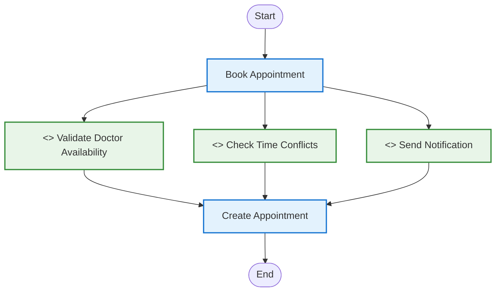
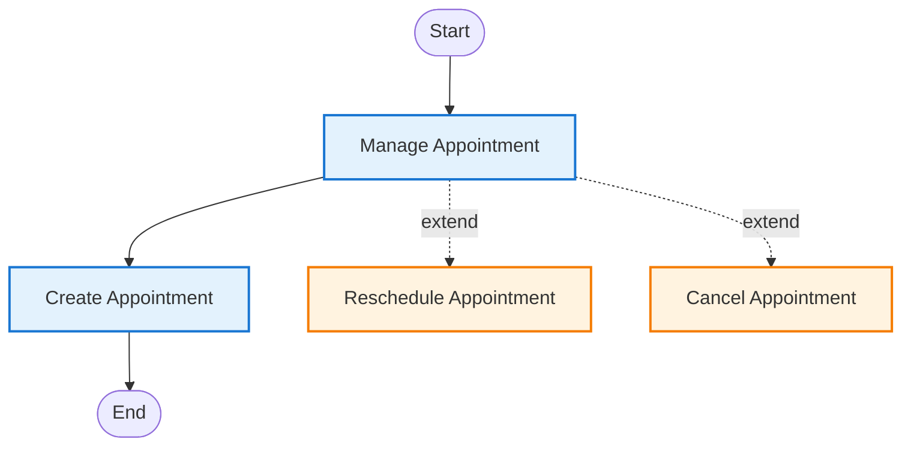
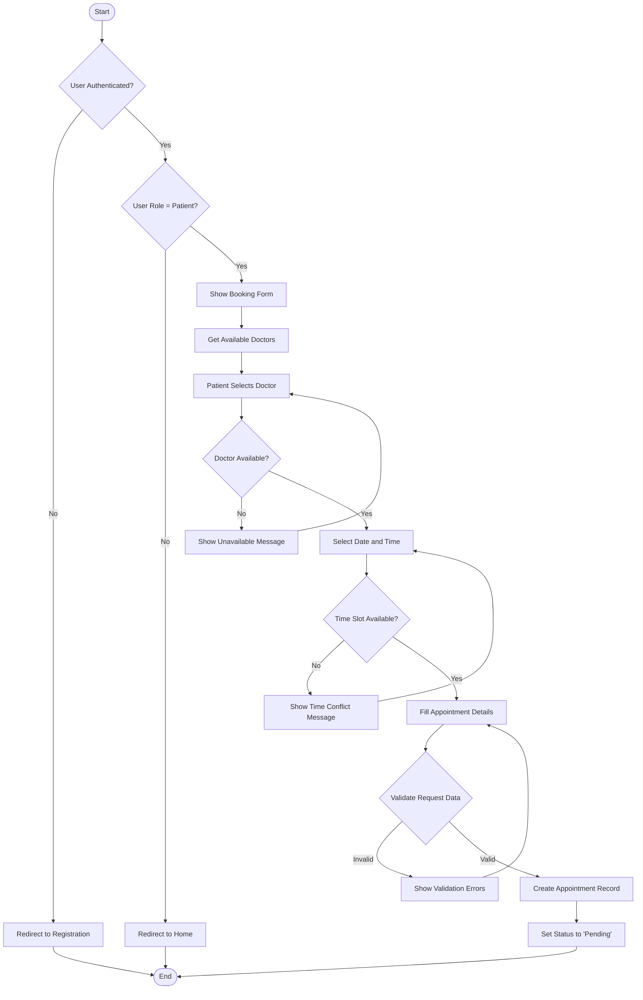
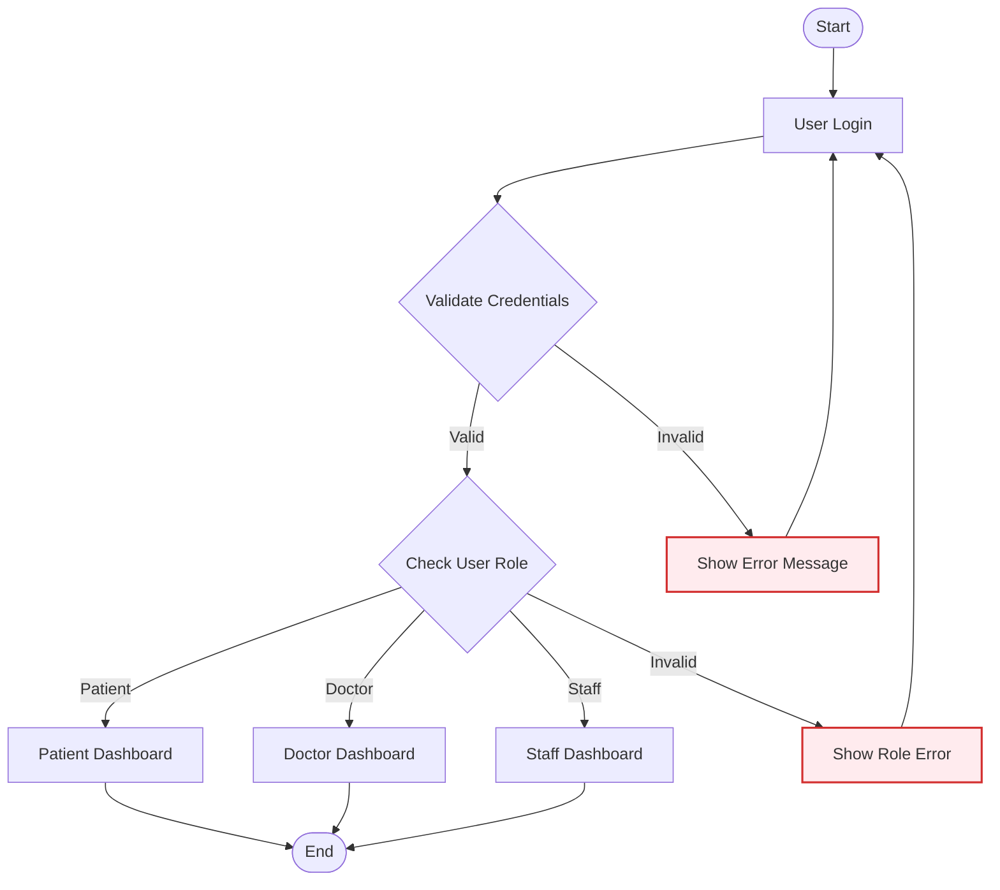
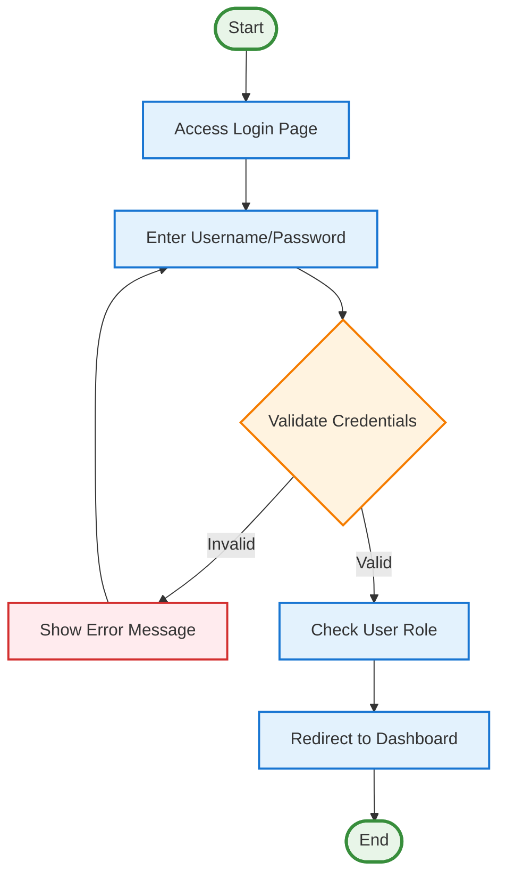
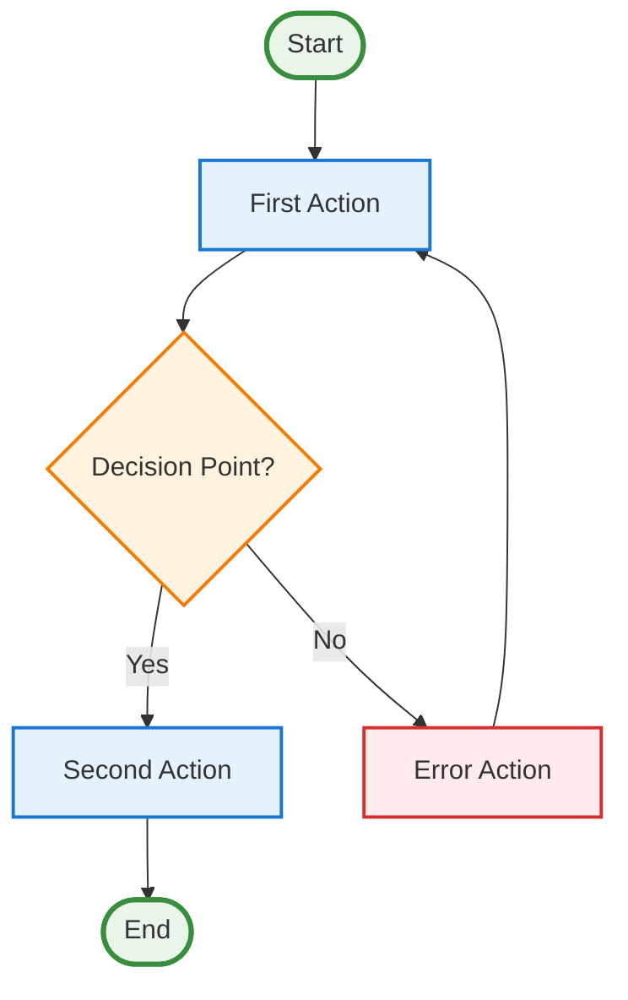

# Step-by-Step Activity Diagram Creation Guide

## 📋 **Step 1: Understanding Activity Diagrams**

### What is an Activity Diagram?
An activity diagram shows the flow of activities in a system, like a flowchart that describes how processes work step by step.

### Key Components:
- **Start Node**: Where the process begins
- **Action Nodes**: What happens at each step
- **Decision Nodes**: Points where choices are made
- **End Node**: Where the process ends
- **Flow Arrows**: Show the direction of the process

---

## 📋 **Step 2: Basic Symbols and Their Usage**

### Essential Symbols:

| Symbol | Name | Usage | Example |
|--------|------|-------|---------|
| `([Start])` | Start Node | Beginning of process | `Start([Start])` |
| `([End])` | End Node | End of process | `End([End])` |
| `[Action]` | Action Node | Process step | `Login[User Login]` |
| `{Decision}` | Decision Node | Conditional choice | `Valid{Valid?}` |
| `-->` | Flow Arrow | Shows direction | `Start --> Login` |

### Example Basic Flow:

---

## 📋 **Step 3: Creating Your First Activity Diagram**

### Let's create a simple login process:

#### Step 3.1: Identify the Process Steps
1. User accesses login page
2. User enters credentials
3. System validates credentials
4. If valid: redirect to dashboard
5. If invalid: show error message
6. Process ends

#### Step 3.2: Write the Mermaid Code

#### Step 3.3: Add Styling

---

## 📋 **Step 4: Adding Include Relationships**

### What are Include Relationships?
Include relationships show processes that **always** happen as part of another process.

### Example: Appointment Booking with Includes

---

## 📋 **Step 5: Adding Extend Relationships**

### What are Extend Relationships?
Extend relationships show processes that **optionally** happen as part of another process.

### Example: Appointment Management with Extends

---

## 📋 **Step 6: Complex Process - Appointment Booking**

### Step 6.1: Break Down the Process
1. Check if user is authenticated
2. Check if user is a patient
3. Show booking form
4. Get available doctors
5. Patient selects doctor
6. Check doctor availability
7. Select date and time
8. Check time conflicts
9. Fill appointment details
10. Validate request
11. Create appointment
12. Set status to pending
13. End process

### Step 6.2: Create the Diagram

---

## 📋 **Step 7: Adding Error Handling**

### Step 7.1: Identify Error Points
- Invalid credentials
- User not authenticated
- Wrong user role
- Doctor unavailable
- Time conflicts
- Validation errors

### Step 7.2: Add Error Paths

---

## 📋 **Step 8: Complete Example - iWellCare Login Process**

### Step 8.1: Full Process Breakdown
1. User accesses login page
2. User enters username and password
3. System validates credentials
4. If invalid: show error and return to login
5. If valid: check user role
6. Redirect to appropriate dashboard based on role
7. Process ends

### Step 8.2: Complete Mermaid Code

---

## 📋 **Step 9: Best Practices**

### Step 9.1: Naming Conventions
- **Actions**: Use verb-noun format (e.g., "Create Appointment")
- **Decisions**: Use question format (e.g., "Valid Credentials?")
- **Start/End**: Use "Start" and "End"

### Step 9.2: Flow Direction
- **Primary Flow**: Top to bottom
- **Error Flow**: Can go backward or to separate paths
- **Decision Branches**: Left to right

### Step 9.3: Styling Guidelines
- **Start/End**: Green
- **Process Actions**: Blue
- **Decisions**: Orange
- **Errors**: Red
- **Includes**: Green
- **Extends**: Orange

---

## 📋 **Step 10: Practice Exercises**

### Exercise 1: Simple Registration Process
Create an activity diagram for user registration with:
- Fill registration form
- Validate form data
- Create user account
- Send confirmation email
- Redirect to login

### Exercise 2: Appointment Management
Create an activity diagram for appointment management with:
- View appointments
- Create new appointment
- Edit existing appointment
- Delete appointment
- Include: Validate availability
- Extend: Reschedule appointment

### Exercise 3: Consultation Process
Create an activity diagram for consultation with:
- Select patient
- Record vital signs
- Perform examination
- Make diagnosis
- Create prescription
- Include: Update medical record
- Extend: Schedule follow-up

---

## 📋 **Step 11: Common Mistakes to Avoid**

### ❌ **Don't Do:**
- Mix different diagram types
- Use incorrect symbols
- Forget error handling
- Make flows too complex
- Skip validation steps

### ✅ **Do:**
- Use consistent symbols
- Include error paths
- Keep flows logical
- Add proper styling
- Test your diagrams

---

## 📋 **Step 12: Final Checklist**

Before finalizing your activity diagram, check:

- [ ] All processes have start and end nodes
- [ ] Decision points are clearly marked
- [ ] Error handling is included
- [ ] Include relationships are marked with `<<include>>`
- [ ] Extend relationships use dotted lines
- [ ] Styling is consistent
- [ ] Flow direction is logical
- [ ] All steps are clearly labeled

---

## 🎯 **Quick Reference Card**

### Basic Template:

This step-by-step guide will help you create proper activity diagrams for the iWellCare system!
