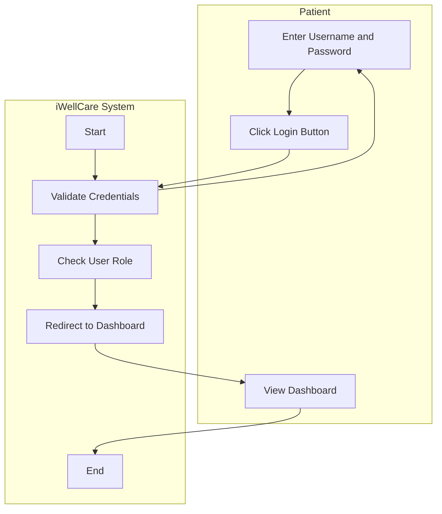
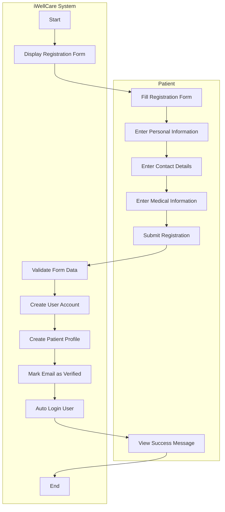
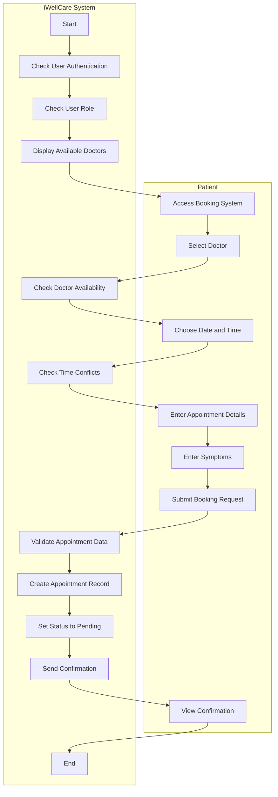
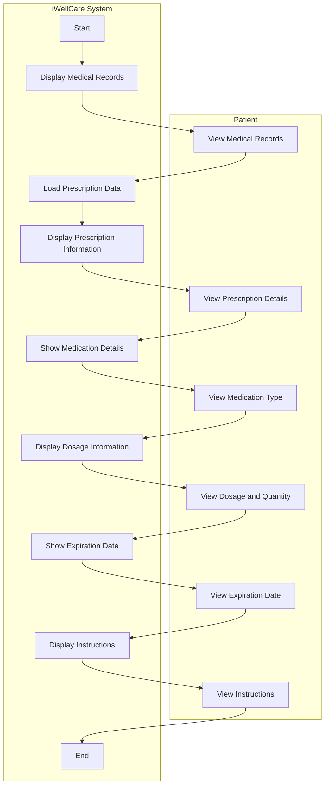
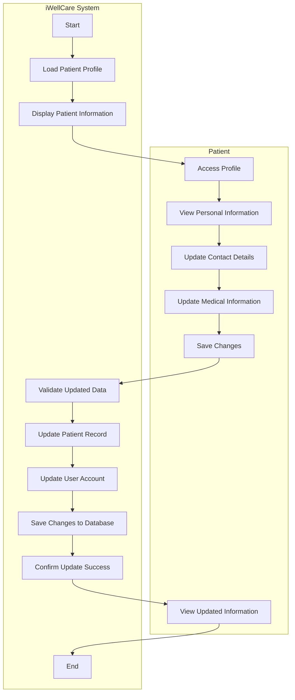
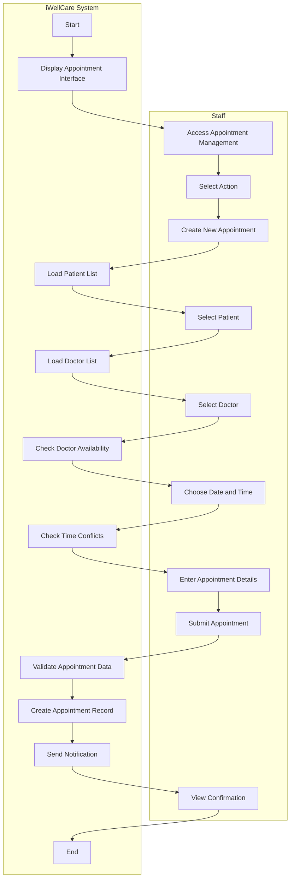
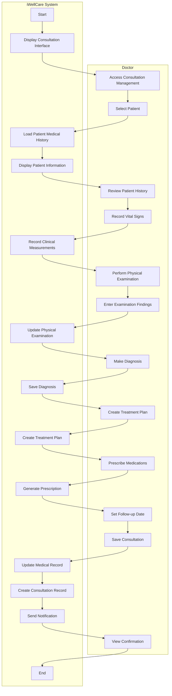
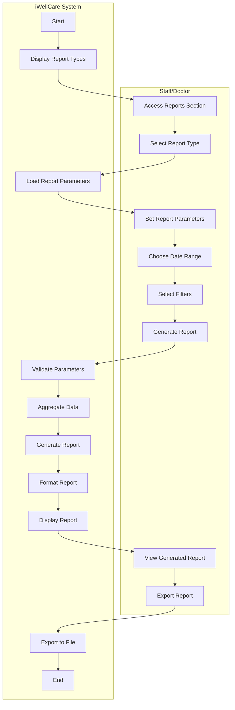

# iWellCare Healthcare Management System - Activity Diagrams (Exact Format)

## Overview
These activity diagrams follow the exact format from your uploaded image, using proper swimlanes with Patient and iWellCare System lanes.

---

## 1. Activity Diagram for User Login Process

**Description:** In the login process, the system validates user credentials and redirects to the appropriate dashboard based on user role.

---

## 2. Activity Diagram for Patient Registration Process

**Description:** In the registration process, the patient fills out the form with personal and medical information, and the system creates the user account and patient profile.

---

## 3. Activity Diagram for Booking Appointment Process

**Description:** In booking an appointment, the patient selects a doctor and time slot, and the system validates availability and creates the appointment record.

---

## 4. Activity Diagram for Viewing Medical Records/Prescription

**Description:** In viewing medical records and prescription information, the system displays the medical records and prescription details, and the patient views the medication type, dosage, quantity, expiration date, and instructions.

---

## 5. Activity Diagram for Managing Patient Information

**Description:** In managing patient information, the patient accesses their profile, updates personal and medical information, and the system validates and saves the changes to the database.

---

## 6. Activity Diagram for Staff Managing Appointments

**Description:** In managing appointments, the staff creates new appointments by selecting patients and doctors, and the system validates availability and creates the appointment record.

---

## 7. Activity Diagram for Doctor Managing Consultations

**Description:** In managing consultations, the doctor reviews patient history, performs examinations, makes diagnoses, and creates treatment plans, while the system records all medical data and updates patient records.

---

## 8. Activity Diagram for Viewing Reports

**Description:** In viewing reports, the staff or doctor selects report types and parameters, and the system aggregates data, generates formatted reports, and provides export functionality.

---

## Key Features of This Format:

### **✅ Swimlane Structure:**
- **Left Lane**: Patient/Staff/Doctor actions
- **Right Lane**: iWellCare System processes
- **Clear Separation**: Each actor has their own dedicated lane

### **✅ Flow Direction:**
- **Vertical Flow**: Top to bottom within each lane
- **Horizontal Transitions**: Between lanes when interaction occurs
- **Logical Sequence**: Each step follows logically from the previous

### **✅ Activity Nodes:**
- **Rectangular Boxes**: All activities in rounded rectangles
- **Clear Labels**: Descriptive action names
- **Proper Naming**: Verb-noun format

### **✅ Start and End Nodes:**
- **Start**: Solid circle in system lane
- **End**: Solid circle with outer ring in system lane
- **Consistent Placement**: Always in the system lane

### **✅ Description Text:**
- **Below Each Diagram**: Clear explanation of the process
- **Consistent Format**: "In [process name], the [actor] [action], and the system [action]."

This format exactly matches your uploaded image structure with proper swimlanes, clear flow direction, and descriptive text below each diagram!
