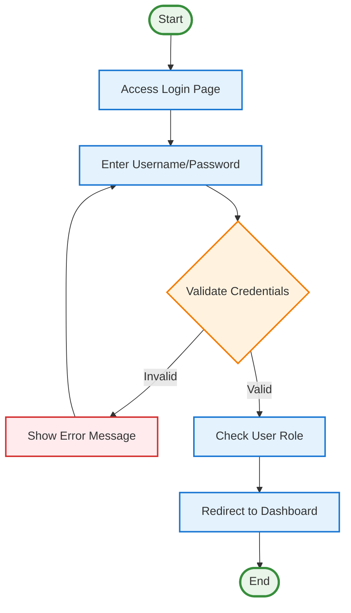
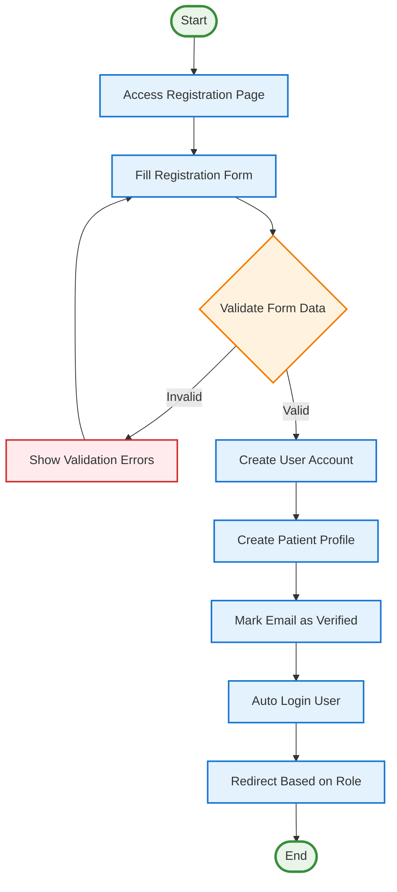
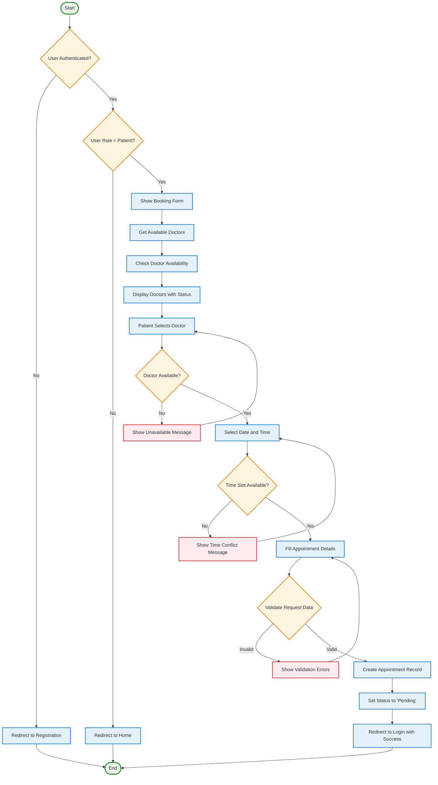
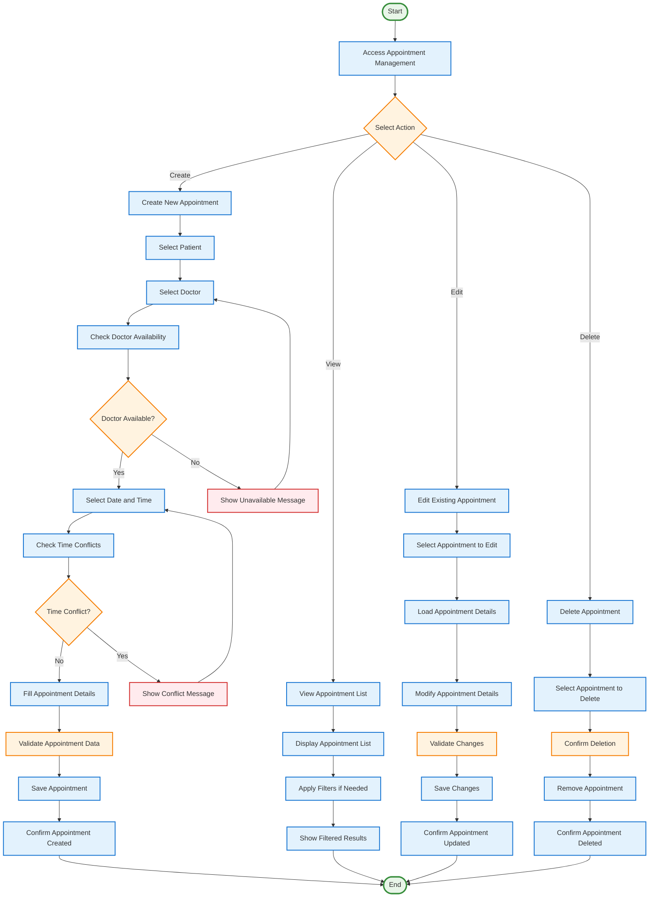
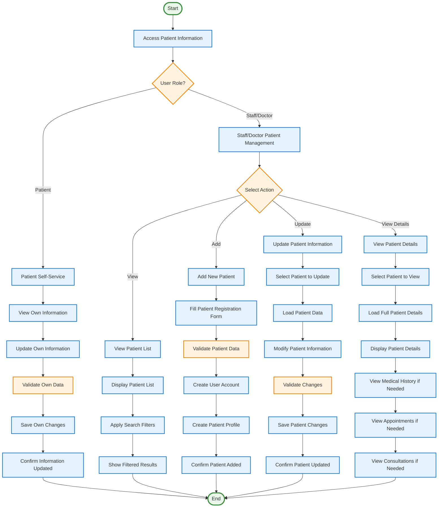

# iWellCare Core Use Cases - Fixed Activity Diagrams

## 1. Main System Login Process

## 2. User Registration Process

## 3. Appointment Booking Process (Patient)

## 4. Appointment Management Process (Staff/Doctor)

## 5. Consultation Management Process

```mermaid
graph TD
    Start([Start]) --> AccessConsultation[Access Consultation Management]
    AccessConsultation --> SelectAction{Select Action}
    
    SelectAction -->|Start New| StartConsultation[Start New Consultation]
    SelectAction -->|View| ViewConsultations[View Consultation History]
    SelectAction -->|Update| UpdateConsultation[Update Consultation]
    
    %% Start New Consultation Process
    StartConsultation --> SelectPatient[Select Patient]
    SelectPatient --> SelectAppointment[Select Appointment]
    SelectAppointment --> LoadPatientHistory[Load Patient Medical History]
    LoadPatientHistory --> EnterChiefComplaint[Enter Chief Complaint]
    EnterChiefComplaint --> EnterPresentIllness[Enter Present Illness]
    EnterPresentIllness --> EnterMedicalHistory[Enter Past Medical History]
    EnterMedicalHistory --> EnterFamilyHistory[Enter Family History]
    EnterFamilyHistory --> EnterSocialHistory[Enter Social History]
    
    EnterSocialHistory --> RecordVitalSigns[Record Clinical Measurements]
    RecordVitalSigns --> PerformPhysicalExam[Perform Physical Examination]
    PerformPhysicalExam --> EnterFindings[Enter Physical Examination Findings]
    EnterFindings --> MakeDiagnosis[Make Diagnosis]
    MakeDiagnosis --> CreateTreatmentPlan[Create Treatment Plan]
    CreateTreatmentPlan --> PrescribeMedication[Prescribe Medications]
    PrescribeMedication --> SetFollowUp[Set Follow-up Date if Needed]
    SetFollowUp --> AddConsultationNotes[Add Consultation Notes]
    AddConsultationNotes --> SaveConsultation[Save Consultation Record]
    SaveConsultation --> UpdateMedicalRecord[Update Patient Medical Record]
    UpdateMedicalRecord --> CreatePrescription[Create Prescription Record]
    CreatePrescription --> ConfirmCompleted[Confirm Consultation Completed]
    
    %% View Consultations Process
    ViewConsultations --> DisplayList[Display Consultation List]
    DisplayList --> ApplyFilters[Apply Date/Patient Filters]
    ApplyFilters --> ShowResults[Show Filtered Consultations]
    ShowResults --> ViewDetails[View Consultation Details if Selected]
    
    %% Update Consultation Process
    UpdateConsultation --> SelectConsultation[Select Consultation to Update]
    SelectConsultation --> LoadConsultation[Load Consultation Details]
    LoadConsultation --> ModifyDetails[Modify Consultation Details]
    ModifyDetails --> ValidateChanges[Validate Changes]
    ValidateChanges --> SaveChanges[Save Changes]
    SaveChanges --> UpdateRecords[Update Related Records]
    UpdateRecords --> ConfirmUpdated[Confirm Consultation Updated]
    
    ConfirmCompleted --> End([End])
    ViewDetails --> End
    ConfirmUpdated --> End
    
    %% Styling
    classDef startEnd fill:#e8f5e8,stroke:#388e3c,stroke-width:3px
    classDef process fill:#e3f2fd,stroke:#1976d2,stroke-width:2px
    classDef decision fill:#fff3e0,stroke:#f57c00,stroke-width:2px
    
    class Start,End startEnd
    class AccessConsultation,StartConsultation,SelectPatient,SelectAppointment,LoadPatientHistory,EnterChiefComplaint,EnterPresentIllness,EnterMedicalHistory,EnterFamilyHistory,EnterSocialHistory,RecordVitalSigns,PerformPhysicalExam,EnterFindings,MakeDiagnosis,CreateTreatmentPlan,PrescribeMedication,SetFollowUp,AddConsultationNotes,SaveConsultation,UpdateMedicalRecord,CreatePrescription,ConfirmCompleted,ViewConsultations,DisplayList,ApplyFilters,ShowResults,ViewDetails,UpdateConsultation,SelectConsultation,LoadConsultation,ModifyDetails,ValidateChanges,SaveChanges,UpdateRecords,ConfirmUpdated process
    class SelectAction,ValidateChanges decision
```

## 6. Patient Information Management Process

## 7. Include and Extend Relationships Diagram

```mermaid
graph TD
    %% Main Use Cases
    Login[Login Process] --> ValidateCredentials[<<include>> Validate Credentials]
    Login --> CheckRole[<<include>> Check User Role]
    
    BookAppointment[Book Appointment] --> ValidateAvailability[<<include>> Validate Doctor Availability]
    BookAppointment --> CheckConflicts[<<include>> Check Time Conflicts]
    BookAppointment --> SendNotification[<<include>> Send Notification]
    
    ManageAppointment[Manage Appointment] --> ValidateAvailability
    ManageAppointment --> CheckConflicts
    ManageAppointment --> SendNotification
    
    ManageConsultation[Manage Consultation] --> RecordVitals[<<include>> Record Vital Signs]
    ManageConsultation --> CreatePrescription[<<include>> Create Prescription]
    ManageConsultation --> UpdateMedicalRecord[<<include>> Update Medical Record]
    
    ManagePatientInfo[Manage Patient Information] --> ValidatePatientData[<<include>> Validate Patient Data]
    ManagePatientInfo --> SaveChanges[<<include>> Save Changes]
    
    ManageMedication[Manage Medication] --> CheckInventory[<<include>> Check Medication Inventory]
    ManageMedication --> ValidatePrescription[<<include>> Validate Prescription]
    ManageMedication --> UpdateStock[<<include>> Update Stock Levels]
    
    ManageInvoice[Manage Invoice] --> CalculateCharges[<<include>> Calculate Service Charges]
    ManageInvoice --> GenerateInvoice[<<include>> Generate Invoice Document]
    ManageInvoice --> ProcessPayment[<<include>> Process Payment]
    
    GenerateReports[Generate Reports] --> AggregateData[<<include>> Aggregate Data]
    GenerateReports --> FormatReport[<<include>> Format Report]
    
    %% Extend Relationships (Optional)
    ManageAppointment -.->|extend| RescheduleAppointment[Reschedule Appointment]
    ManageAppointment -.->|extend| CancelAppointment[Cancel Appointment]
    
    ManageConsultation -.->|extend| ScheduleFollowUp[Schedule Follow-up]
    ManageConsultation -.->|extend| CreateReferral[Create Referral]
    
    ManagePatientInfo -.->|extend| UpdateProfilePhoto[Update Profile Photo]
    ManagePatientInfo -.->|extend| UpdateEmergencyContact[Update Emergency Contact]
    
    GenerateReports -.->|extend| ExportReport[Export Report]
    GenerateReports -.->|extend| ScheduleRecurringReport[Schedule Recurring Report]
    
    %% Styling
    classDef mainUseCase fill:#e3f2fd,stroke:#1976d2,stroke-width:2px
    classDef includeUseCase fill:#e8f5e8,stroke:#388e3c,stroke-width:2px
    classDef extendUseCase fill:#fff3e0,stroke:#f57c00,stroke-width:2px
    
    class Login,BookAppointment,ManageAppointment,ManageConsultation,ManagePatientInfo,ManageMedication,ManageInvoice,GenerateReports mainUseCase
    class ValidateCredentials,CheckRole,ValidateAvailability,CheckConflicts,SendNotification,RecordVitals,CreatePrescription,UpdateMedicalRecord,ValidatePatientData,SaveChanges,CheckInventory,ValidatePrescription,UpdateStock,CalculateCharges,GenerateInvoice,ProcessPayment,AggregateData,FormatReport includeUseCase
    class RescheduleAppointment,CancelAppointment,ScheduleFollowUp,CreateReferral,UpdateProfilePhoto,UpdateEmergencyContact,ExportReport,ScheduleRecurringReport extendUseCase
```

## Use Case Relationships Summary

### **Include Relationships (Always Executed)**
- **Validate Credentials** ← Login Process
- **Check User Role** ← Login Process
- **Validate Doctor Availability** ← Manage Appointment, Book Appointment
- **Check Time Conflicts** ← Manage Appointment, Book Appointment  
- **Send Notification** ← Manage Appointment, Book Appointment
- **Record Vital Signs** ← Manage Consultation
- **Create Prescription** ← Manage Consultation
- **Update Medical Record** ← Manage Consultation
- **Validate Patient Data** ← Manage Patient Information
- **Save Changes** ← Manage Patient Information
- **Check Medication Inventory** ← Manage Medication
- **Validate Prescription** ← Manage Medication
- **Update Stock Levels** ← Manage Medication
- **Calculate Service Charges** ← Manage Invoice
- **Generate Invoice Document** ← Manage Invoice
- **Process Payment** ← Manage Invoice
- **Aggregate Data** ← Generate Reports
- **Format Report** ← Generate Reports

### **Extend Relationships (Conditionally Executed)**
- **Reschedule Appointment** → Manage Appointment
- **Cancel Appointment** → Manage Appointment
- **Schedule Follow-up** → Manage Consultation
- **Create Referral** → Manage Consultation
- **Update Profile Photo** → Manage Patient Information
- **Update Emergency Contact** → Manage Patient Information
- **Export Report** → Generate Reports
- **Schedule Recurring Report** → Generate Reports

## **Fixed Activity Diagram Features:**

### **✅ Proper Symbols Used:**
- **`([Start])`** and **`([End])`** - Correct start/end nodes
- **`[Action]`** - Proper action rectangles
- **`{Decision}`** - Correct decision diamonds
- **`<<include>>`** - Include relationships
- **`<<extend>>`** - Extend relationships with dotted lines

### **✅ Correct Alignment:**
- **Top to Bottom Flow** - Logical process progression
- **Left to Right Branching** - Clear decision paths
- **Proper Error Handling** - Separate error paths
- **Consistent Styling** - Color-coded elements

### **✅ Based on Real System Processes:**
- **Authentication Flow** - Actual login/registration process
- **Appointment Booking** - Real validation and availability checks
- **Consultation Management** - Complete medical workflow
- **Patient Management** - Role-based access control
- **Include/Extend Relationships** - Proper UML relationships

The diagrams now follow proper activity diagram conventions and reflect the actual iWellCare system processes!
