# iWellCare Healthcare Management System - Complete ERD with Actions, Notations & Cardinality

This document contains the complete Entity Relationship Diagram for the iWellCare Healthcare Management System using Mermaid syntax, including action words, notation explanations, and cardinality mappings.

## Complete ERD with Actions and Cardinality


## Complete Cardinality Mapping with Actions

### **1..1 Relationships (One-to-One)**


**Cardinality**: `1..1` = **Exactly One to Exactly One**
- **Action**: Each entity performs one specific action with one other entity
- **Example**: One user registers one patient, one appointment triggers one consultation

### **1..* Relationships (One-to-Many)**


**Cardinality**: `1..*` = **One to Many**
- **Action**: One entity performs actions with multiple instances of another entity
- **Example**: One patient can book multiple appointments, one doctor can accept multiple appointments

## Complete Notation Reference

### **Mermaid ERD Notations**
```mermaid
erDiagram
    %% Entity Definition
    entity_name {
        data_type field_name PK/FK
    }
    
    %% Relationship Types
    entity1 ||--|| entity2 : "1..1 relationship"
    entity1 ||--o{ entity2 : "1..* relationship"
    entity1 o{--|| entity2 : "0..1 relationship"
    entity1 o{--o{ entity2 : "0..* relationship"
```

### **Cardinality Notations with Actions**

| **Cardinality** | **Mermaid** | **Action Example** | **What Happens** |
|-----------------|--------------|-------------------|-------------------|
| **`1..1`** | `\|\|--\|\|` | **"REGISTERS"** | One user registers one patient |
| **`1..*`** | `\|\|--o{` | **"BOOKS"** | One patient books many appointments |
| **`0..1`** | `o{--\|\|` | **"ASSIGNS"** | Zero or one doctor assigned to room |
| **`0..*`** | `o{--o{` | **"MANAGES"** | Zero or many inventory items managed |

## Action Flow with Cardinality

### **Level 1: User Management (1..1)**

**Actions**: 
- **REGISTERS**: One user creates one patient profile
- **EMPLOYS**: One user hires one doctor

### **Level 2: Profile Creation (1..*)**

**Actions**:
- **BOOKS**: One patient can book multiple appointments
- **ACCEPTS**: One doctor can accept multiple appointments

### **Level 3: Appointment Processing (1..1)**

**Actions**:
- **TRIGGERS**: One appointment triggers one consultation
- **GENERATES**: One appointment generates one billing record

### **Level 4: Medical Records (1..1)**

**Actions**:
- **CREATES**: One consultation creates one medical record
- **ISSUES**: One consultation issues one prescription

### **Supporting Systems (1..*)**

**Actions**:
- **MANAGES**: One user manages multiple inventory items
- **VERIFIES**: One user verifies multiple OTP codes

## Complete System Flow with Actions and Cardinality

```mermaid
flowchart TD
    A[🔐 REGISTER USERS] --> B[👥 CREATE PROFILES]
    B --> C[📅 SCHEDULE APPOINTMENTS]
    C --> D[🩺 CONDUCT CONSULTATIONS]
    D --> E[📋 MAINTAIN RECORDS]
    E --> F[💰 PROCESS BILLING]
    
    %% Cardinality Indicators
    A1[1..1] --> A
    B1[1..*] --> B
    C1[1..1] --> C
    D1[1..1] --> D
    E1[1..1] --> E
    F1[1..1] --> F
    
    %% Action Words
    A2[REGISTER] --> A
    B2[CREATE] --> B
    C2[SCHEDULE] --> C
    D2[CONDUCT] --> D
    E2[MAINTAIN] --> E
    F2[PROCESS] --> F
```



## Action Words by Cardinality Level

| **Level** | **Cardinality** | **Action** | **Mermaid** | **What Happens** |
|-----------|------------------|------------|--------------|-------------------|
| 🔐 **1** | **1..1** | **"REGISTERS"** | `\|\|--\|\|` | One user registers one patient |
| 👥 **2** | **1..*** | **"BOOKS"** | `\|\|--o{` | One patient books many appointments |
| 📅 **3** | **1..1** | **"TRIGGERS"** | `\|\|--\|\|` | One appointment triggers one consultation |
| 🩺 **4** | **1..1** | **"CREATES"** | `\|\|--\|\|` | One consultation creates one medical record |
| 📋 **5** | **1..1** | **"ISSUES"** | `\|\|--\|\|` | One consultation issues one prescription |
| 💰 **6** | **1..1** | **"GENERATES"** | `\|\|--\|\|` | One appointment generates one billing |

## How to Read the Complete Notation

### **Step 1: Identify Cardinality**
```mermaid
users ||--|| patients : "REGISTERS"
```
- **`||--||`**: This is a `1..1` relationship
- **Cardinality**: One user relates to exactly one patient

### **Step 2: Read the Action**
- **"REGISTERS"**: The action performed by the user
- **What happens**: The user registers the patient

### **Step 3: Understand the Flow**
```mermaid
patients ||--o{ appointments : "BOOKS"
```
- **`||--o{`**: This is a `1..*` relationship
- **Cardinality**: One patient can relate to many appointments
- **Action**: The patient books multiple appointments

### **Step 4: Follow the Complete Chain**
1. **Users REGISTER patients** (1..1) → Patient profiles created
2. **Patients BOOK appointments** (1..*) → Multiple appointments scheduled
3. **Appointments TRIGGER consultations** (1..1) → One consultation per appointment
4. **Consultations CREATE records** (1..1) → One medical record per consultation

## Benefits of Complete Notation

- **🎯 Precise Relationships**: Shows exact cardinality between entities
- **🔄 Clear Actions**: Demonstrates what each entity does
- **📊 Mathematical Accuracy**: Uses standard ERD notation
- **👥 Stakeholder Clarity**: Both technical and non-technical people understand
- **🔍 System Analysis**: Helps identify bottlenecks and optimization opportunities

## Summary of Notations Used

| **Element** | **Notation** | **Purpose** |
|-------------|---------------|-------------|
| **Entity** | `entity_name {}` | Defines database tables |
| **Primary Key** | `PK` | Uniquely identifies records |
| **Foreign Key** | `FK` | Links to other tables |
| **One-to-One** | `\|\|--\|\|` | 1..1 relationship |
| **One-to-Many** | `\|\|--o{` | 1..* relationship |
| **Action Label** | `: "ACTION"` | Describes what happens |
| **Comments** | `%% text` | Organizes and explains |

Now you have the **complete ERD** with actions, Mermaid notations, and cardinality mappings! 🎉
