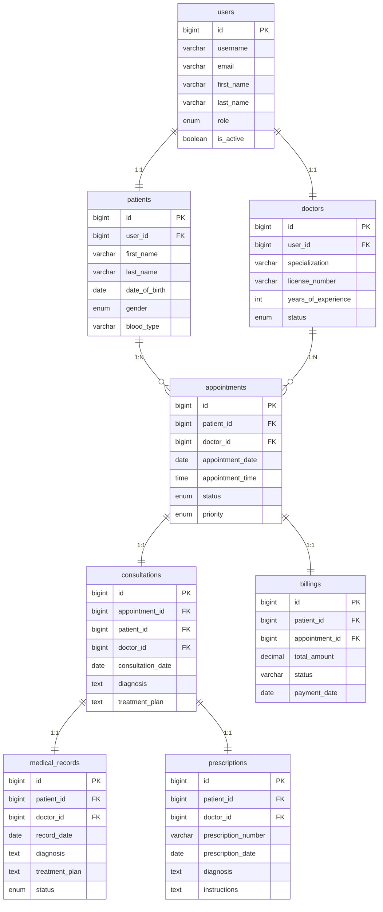
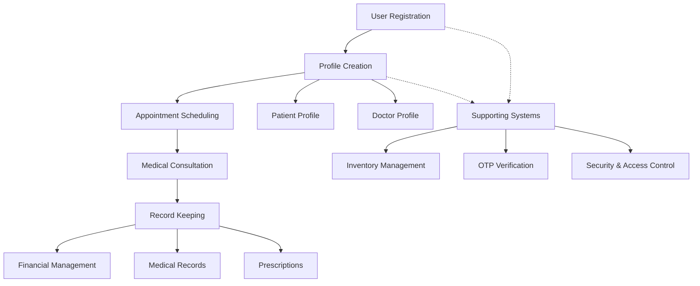

# iWellCare Healthcare Management System - Mermaid ERD

This document contains the Entity Relationship Diagram for the iWellCare Healthcare Management System using Mermaid syntax.

## Complete ERD with All Attributes

```mermaid
erDiagram
    %% Level 1: User Management
    users {
        bigint id PK
        varchar username
        varchar email
        varchar password
        varchar first_name
        varchar last_name
        varchar middle_name
        date date_of_birth
        enum gender
        varchar phone_number
        varchar street_address
        varchar city
        varchar state_province
        varchar postal_code
        varchar country
        enum role
        boolean is_active
        varchar profile_photo
        timestamp created_at
        timestamp updated_at
    }

    %% Level 2: Profile Creation
    patients {
        bigint id PK
        bigint user_id FK
        varchar first_name
        varchar last_name
        varchar contact
        varchar email
        text address
        date date_of_birth
        enum gender
        varchar blood_type
        varchar emergency_contact
        varchar emergency_contact_phone
        text medical_history
        text allergies
        text current_medications
        varchar insurance_provider
        varchar insurance_number
        timestamp registration_date
        boolean is_active
        timestamp created_at
        timestamp updated_at
    }

    doctors {
        bigint id PK
        bigint user_id FK
        varchar specialization
        varchar license_number
        int years_of_experience
        text qualifications
        text bio
        enum status
        decimal consultation_fee
        json available_days
        json available_hours
        varchar contact_number
        varchar emergency_contact
        text address
        varchar city
        varchar state
        varchar postal_code
        varchar country
        timestamp created_at
        timestamp updated_at
    }

    %% Level 3: Appointment Scheduling
    appointments {
        bigint id PK
        bigint patient_id FK
        bigint doctor_id FK
        date appointment_date
        time appointment_time
        varchar type
        enum status
        text notes
        text symptoms
        enum priority
        int duration
        varchar room_number
        bigint created_by FK
        bigint updated_by FK
        timestamp created_at
        timestamp updated_at
    }

    %% Level 4: Medical Consultation
    consultations {
        bigint id PK
        bigint appointment_id FK
        bigint patient_id FK
        bigint doctor_id FK
        date consultation_date
        time consultation_time
        enum status
        text chief_complaint
        text present_illness
        text past_medical_history
        text family_history
        text social_history
        json clinical_measurements
        text symptoms
        text diagnosis
        text treatment_plan
        text prescription
        text notes
        timestamp created_at
        timestamp updated_at
    }

    %% Level 5: Record Keeping
    medical_records {
        bigint id PK
        bigint patient_id FK
        bigint doctor_id FK
        bigint appointment_id FK
        varchar record_number
        date record_date
        varchar chief_complaint
        text present_illness
        text past_medical_history
        text family_history
        text social_history
        text review_of_systems
        text physical_examination
        text diagnosis
        text treatment_plan
        text medications_prescribed
        text lab_results
        text imaging_results
        text clinical_measurements
        text allergies
        text notes
        enum status
        enum record_type
        boolean is_confidential
        timestamp created_at
        timestamp updated_at
    }

    prescriptions {
        bigint id PK
        bigint patient_id FK
        bigint doctor_id FK
        bigint appointment_id FK
        varchar prescription_number
        date prescription_date
        text diagnosis
        text notes
        text instructions
        enum status
        date valid_until
        boolean is_printed
        timestamp printed_at
        timestamp created_at
        timestamp updated_at
    }

    %% Level 6: Financial Management
    billings {
        bigint id PK
        bigint patient_id FK
        bigint appointment_id FK
        decimal amount
        decimal consultation_fee
        decimal medication_fee
        decimal laboratory_fee
        decimal other_fees
        decimal total_amount
        varchar status
        date payment_date
        timestamp created_at
        timestamp updated_at
    }

    %% Supporting Systems
    inventory {
        bigint id PK
        varchar name
        text description
        enum category
        int quantity
        int reorder_level
        date expiration_date
        decimal unit_price
        varchar supplier
        varchar location
        varchar batch_number
        text notes
        bigint created_by FK
        bigint updated_by FK
        timestamp last_updated
        boolean is_active
        boolean archived
        timestamp created_at
        timestamp updated_at
    }

    otp_codes {
        bigint id PK
        varchar email
        varchar code
        enum type
        timestamp expires_at
        boolean is_used
        timestamp created_at
        timestamp updated_at
    }

    %% Relationships - Top to Bottom Flow
    users ||--|| patients : "1:1"
    users ||--|| doctors : "1:1"
    users ||--o{ inventory : "1:N"
    users ||--o{ otp_codes : "1:N"

    patients ||--o{ appointments : "1:N"
    doctors ||--o{ appointments : "1:N"

    appointments ||--|| consultations : "1:1"
    appointments ||--|| billings : "1:1"

    consultations ||--|| medical_records : "1:1"
    consultations ||--|| prescriptions : "1:1"
```

## Simplified ERD for Presentations

## System Flow Diagram

## Database Schema Summary

### **Level 1: User Management**
- **users**: Central authentication and user management

### **Level 2: Profile Creation**
- **patients**: Patient demographics and medical history
- **doctors**: Doctor profiles and specializations

### **Level 3: Appointment Scheduling**
- **appointments**: Patient appointment scheduling system

### **Level 4: Medical Consultation**
- **consultations**: Medical consultation records

### **Level 5: Record Keeping**
- **medical_records**: Comprehensive patient records
- **prescriptions**: Medication prescriptions

### **Level 6: Financial Management**
- **billings**: Financial billing and payment tracking

### **Supporting Systems**
- **inventory**: Medical supplies management
- **otp_codes**: Security verification

## How to Use

1. **Copy the Mermaid code** from any section above
2. **Paste into any Mermaid-compatible editor**:
   - GitHub (in Markdown files)
   - GitLab
   - Notion
   - Mermaid Live Editor: https://mermaid.live/
   - VS Code with Mermaid extension

3. **Customize as needed** for your specific use case

## Benefits of Mermaid Version

- **Version Control Friendly**: Easy to track changes in Git
- **Documentation Ready**: Perfect for README files and documentation
- **Collaborative**: Easy to share and modify with team members
- **Multiple Formats**: Can be exported to PNG, SVG, or PDF
- **Lightweight**: No external dependencies or large files
