# iWellCare Healthcare Management System - Mermaid ERD with Action Words

This document contains the Entity Relationship Diagram for the iWellCare Healthcare Management System using Mermaid syntax, including action words to show what happens at each level.

## ERD with Action Words and System Flow


## Complete Mermaid ERD Notations with Actions

### **1. Diagram Declaration Notation**
```mermaid
erDiagram
```
**Action**: **INITIATES** the Entity Relationship Diagram
- **What it does**: Tells Mermaid "This is an ERD diagram"
- **Required**: Must be the first line (case-sensitive)

### **2. Entity Definition Notation**
```mermaid
entity_name {
    data_type field_name PK/FK
}
```
**Action**: **DEFINES** a database table with its structure
- **`entity_name`**: Table name (e.g., `users`, `patients`)
- **`{}`**: Curly braces contain all table fields
- **`PK`**: Primary Key identifier
- **`FK`**: Foreign Key identifier

### **3. Data Type Notations**
```mermaid
bigint id PK          %% Action: IDENTIFIES unique records
string username       %% Action: STORES text data
date date_of_birth    %% Action: RECORDS dates
time appointment_time %% Action: CAPTURES time
datetime created_at   %% Action: TRACKS creation timestamps
decimal amount        %% Action: CALCULATES financial values
int quantity          %% Action: COUNTS items
boolean is_active     %% Action: CONTROLS status
json available_days   %% Action: STORES structured data
```

### **4. Relationship Notations with Actions**

#### **One-to-One Relationship**
```mermaid
users ||--|| patients : "REGISTERS"
```
**Action**: **REGISTERS** - One user creates one patient profile
- **`||--||`**: One-to-one relationship
- **Action Word**: "REGISTERS" (what the user does)

#### **One-to-Many Relationship**
```mermaid
patients ||--o{ appointments : "BOOKS"
```
**Action**: **BOOKS** - One patient can book many appointments
- **`||--o{`**: One-to-many relationship
- **Action Word**: "BOOKS" (what the patient does)

#### **Many-to-Many Relationship**
```mermaid
doctors o{--o{ specializations : "HAS"
```
**Action**: **HAS** - Doctors can have multiple specializations
- **`o{--o{`**: Many-to-many relationship
- **Action Word**: "HAS" (what the doctor possesses)

### **5. Comment Notations**
```mermaid
%% Level 1: User Management - "REGISTER & AUTHENTICATE"
```
**Action**: **ORGANIZES** and **EXPLAINS** diagram sections
- **`%%`**: Starts a comment line
- **Purpose**: Groups related entities and explains their function

### **6. Field Constraint Notations**
```mermaid
bigint user_id FK     %% Action: LINKS to users table
bigint id PK          %% Action: UNIQUELY IDENTIFIES records
enum status           %% Action: RESTRICTS to predefined values
boolean is_active     %% Action: ENABLES/DISABLES records
```

## Action-Oriented Relationship Examples

### **User Management Actions**


**Actions Explained**:
- **"REGISTERS"**: Users register patients into the system
- **"EMPLOYS"**: Users hire and employ doctors

### **Appointment Flow Actions**


**Actions Explained**:
- **"BOOKS"**: Patients book multiple appointments
- **"ACCEPTS"**: Doctors accept multiple appointments

### **Medical Process Actions**


**Actions Explained**:
- **"TRIGGERS"**: Appointment triggers the consultation process
- **"CREATES"**: Consultation creates medical records

## Complete Action Flow Notation


## Action Words by System Level

| **Level** | **Notation** | **Action** | **What Happens** |
|-----------|---------------|------------|-------------------|
| 🔐 **1** | `users \|\|--\|\| patients` | **"REGISTERS"** | Users register patients |
| 👥 **2** | `patients \|\|--o{ appointments` | **"BOOKS"** | Patients book appointments |
| 📅 **3** | `appointments \|\|--\|\| consultations` | **"TRIGGERS"** | Appointments trigger consultations |
| 🩺 **4** | `consultations \|\|--\|\| medical_records` | **"CREATES"** | Consultations create records |
| 📋 **5** | `consultations \|\|--\|\| prescriptions` | **"ISSUES"** | Consultations issue prescriptions |
| 💰 **6** | `appointments \|\|--\|\| billings` | **"GENERATES"** | Appointments generate bills |

## How to Read Action-Oriented Notations

### **Step 1: Identify the Entities**
```mermaid
users ||--|| patients : "REGISTERS"
```
- **Left Entity**: `users` (who performs the action)
- **Right Entity**: `patients` (who receives the action)

### **Step 2: Understand the Relationship Type**
- **`||--||`**: One-to-one (one user registers one patient)
- **`||--o{`**: One-to-many (one patient books many appointments)
- **`o{--o{`**: Many-to-many (many doctors have many specializations)

### **Step 3: Read the Action Word**
- **"REGISTERS"**: The user registers the patient
- **"BOOKS"**: The patient books appointments
- **"TRIGGERS"**: The appointment triggers the consultation

### **Step 4: Follow the Flow**
1. **Users REGISTER patients** → Patient profiles created
2. **Patients BOOK appointments** → Appointments scheduled
3. **Appointments TRIGGER consultations** → Medical process begins
4. **Consultations CREATE records** → Medical history maintained

## Benefits of Action-Oriented Notations

- **🎯 Clear Intent**: Shows what each entity does
- **🔄 Process Flow**: Illustrates the system workflow
- **👥 Stakeholder Understanding**: Non-technical people can follow the process
- **📚 Documentation**: Perfect for training and SOPs
- **🔍 System Analysis**: Helps identify bottlenecks and improvements

## Corrected ERD with Your Data Types

Here's the corrected version using your preferred data type notation:


## Key Mermaid ERD Notation Elements

### **1. Diagram Declaration**
```mermaid
erDiagram
```
- **Must start with**: `erDiagram` (case-sensitive)
- **This tells Mermaid**: "This is an Entity Relationship Diagram"

### **2. Entity Definition**
```mermaid
entity_name {
    data_type field_name PK/FK
}
```
- **Entity name**: Table name in lowercase
- **Curly braces**: `{}` contain the entity attributes
- **PK**: Primary Key identifier
- **FK**: Foreign Key identifier

### **3. Data Types**
- **`bigint`**: Large integer (64-bit)
- **`string`**: Variable-length character string
- **`date`**: Date only (YYYY-MM-DD)
- **`time`**: Time only (HH:MM:SS)
- **`datetime`**: Date and time combined
- **`decimal`**: Decimal number with precision
- **`int`**: Integer (32-bit)
- **`boolean`**: True/False value
- **`json`**: JSON formatted data

### **4. Relationship Syntax**
```mermaid
entity1 ||--|| entity2 : "relationship_label"
```
- **`||--||`**: One-to-one relationship
- **`||--o{`**: One-to-many relationship
- **`o{--o{`**: Many-to-many relationship
- **`relationship_label`**: Description of the relationship

### **5. Comments**
```mermaid
%% This is a comment
```
- **`%%`**: Starts a comment line
- **Useful for**: Organizing sections, explaining relationships

## Action-Oriented System Flow Diagram

```mermaid
flowchart TD
    A[🔐 REGISTER USERS] --> B[👥 CREATE PROFILES]
    B --> C[📅 SCHEDULE APPOINTMENTS]
    C --> D[🩺 CONDUCT CONSULTATIONS]
    D --> E[📋 MAINTAIN RECORDS]
    E --> F[💰 PROCESS BILLING]
    
    B --> B1[👤 Patient Profile]
    B --> B2[👨‍⚕️ Doctor Profile]
    
    E --> E1[📊 Medical Records]
    E --> E2[💊 Prescriptions]
    
    G[🔧 SUPPORTING SYSTEMS] --> G1[📦 Inventory Management]
    G --> G2[🔐 OTP Verification]
    G --> G3[🛡️ Security & Access Control]
    
    A -.-> G
    B -.-> G
    
    %% Action Verbs
    A1[REGISTER] --> A
    B1[CREATE] --> B
    C1[SCHEDULE] --> C
    D1[CONDUCT] --> D
    E1[MAINTAIN] --> E
    F1[PROCESS] --> F
    G1[MANAGE] --> G
```



## Detailed Action Flow with Verbs

```mermaid
flowchart TD
    %% User Management Actions
    A[🔐 REGISTER & AUTHENTICATE] --> A1[Create Account]
    A --> A2[Set Role]
    A --> A3[Enable/Disable Access]
    
    %% Profile Creation Actions
    B[👥 CREATE PROFILES] --> B1[Register Patient]
    B --> B2[Hire Doctor]
    B --> B3[Collect Information]
    B --> B4[Verify Credentials]
    
    %% Appointment Actions
    C[📅 SCHEDULE APPOINTMENTS] --> C1[Check Availability]
    C --> C2[Book Time Slot]
    C --> C3[Assign Room]
    C --> C4[Send Confirmations]
    
    %% Consultation Actions
    D[🩺 CONDUCT CONSULTATIONS] --> D1[Examine Patient]
    D --> D2[Record Symptoms]
    D --> D3[Make Diagnosis]
    D --> D4[Plan Treatment]
    
    %% Record Actions
    E[📋 MAINTAIN RECORDS] --> E1[Update Medical History]
    E --> E2[Issue Prescriptions]
    E --> E3[Store Lab Results]
    E --> E4[Track Progress]
    
    %% Billing Actions
    F[💰 PROCESS BILLING] --> F1[Calculate Fees]
    F --> F2[Generate Invoice]
    F --> F3[Process Payment]
    F --> F4[Send Receipts]
    
    %% Supporting Actions
    G[🔧 SUPPORTING SYSTEMS] --> G1[Track Inventory]
    G --> G2[Verify OTP]
    G --> G3[Manage Security]
    G --> G4[Monitor Access]
```

## Action Words Summary by Level

### **Level 1: User Management** 🔐
- **Action**: REGISTER & AUTHENTICATE
- **Verbs**: Create, Login, Verify, Enable, Disable
- **What Happens**: Users sign up, get authenticated, and access the system

### **Level 2: Profile Creation** 👥
- **Action**: CREATE PROFILES
- **Verbs**: Register, Hire, Collect, Verify, Store
- **What Happens**: Patient and doctor profiles are created with detailed information

### **Level 3: Appointment Scheduling** 📅
- **Action**: SCHEDULE APPOINTMENTS
- **Verbs**: Check, Book, Assign, Send, Confirm
- **What Happens**: Appointments are scheduled, rooms assigned, confirmations sent

### **Level 4: Medical Consultation** 🩺
- **Action**: CONDUCT CONSULTATIONS
- **Verbs**: Examine, Record, Diagnose, Plan, Treat
- **What Happens**: Doctors examine patients, make diagnoses, and plan treatments

### **Level 5: Record Keeping** 📋
- **Action**: MAINTAIN RECORDS
- **Verbs**: Update, Issue, Store, Track, Maintain
- **What Happens**: Medical records are updated, prescriptions issued, progress tracked

### **Level 6: Financial Management** 💰
- **Action**: PROCESS BILLING
- **Verbs**: Calculate, Generate, Process, Send, Collect
- **What Happens**: Bills are calculated, invoices generated, payments processed

### **Supporting Systems** 🔧
- **Action**: MANAGE SUPPORT
- **Verbs**: Track, Verify, Monitor, Manage, Control
- **What Happens**: Inventory tracked, security verified, access controlled

## How to Use These Action-Oriented Diagrams

1. **Copy the Mermaid code** from any section above
2. **Paste into Mermaid-compatible editors**:
   - GitHub/GitLab (in Markdown files)
   - Notion
   - Mermaid Live Editor: https://mermaid.live/
   - VS Code with Mermaid extension

3. **Use for different purposes**:
   - **Complete ERD**: For technical documentation
   - **Action Flow**: For stakeholder presentations
   - **Detailed Actions**: For process documentation

## Benefits of Action-Oriented Approach

- **Clear Process Flow**: Shows what happens at each step
- **Stakeholder Friendly**: Non-technical people can understand the system
- **Process Documentation**: Perfect for SOPs and training materials
- **System Analysis**: Helps identify bottlenecks and improvement areas
- **User Stories**: Supports agile development and requirements gathering
