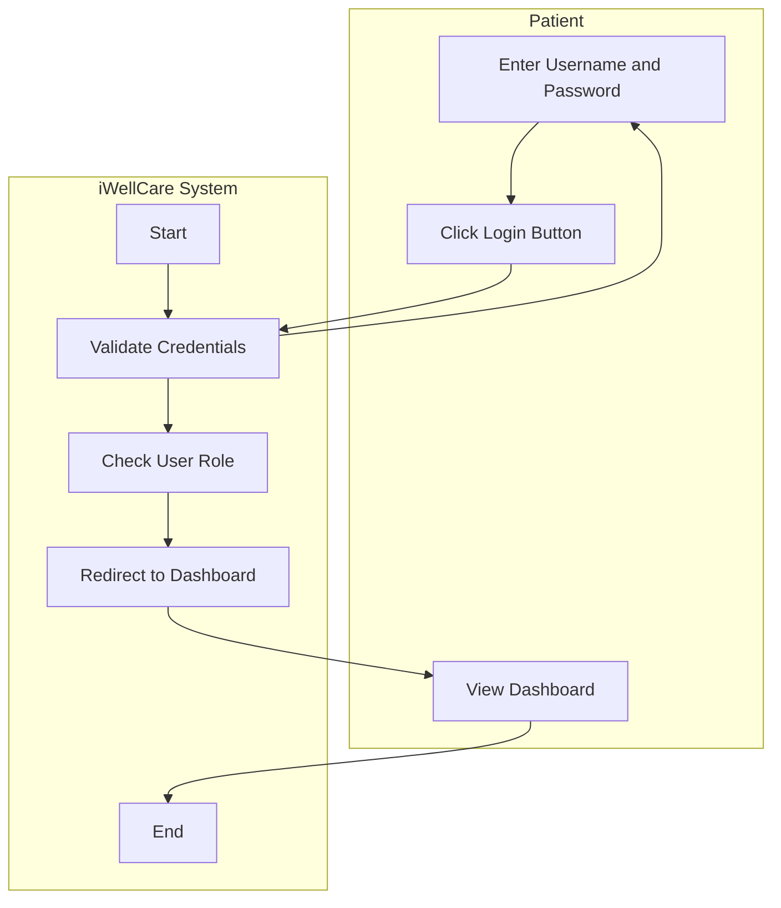
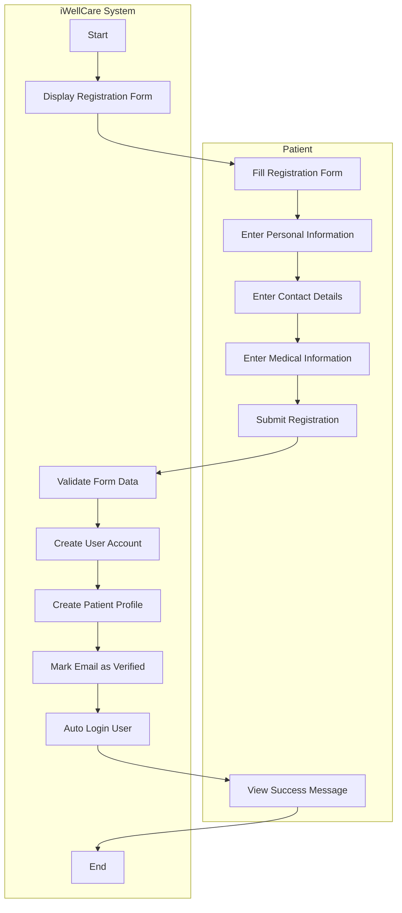
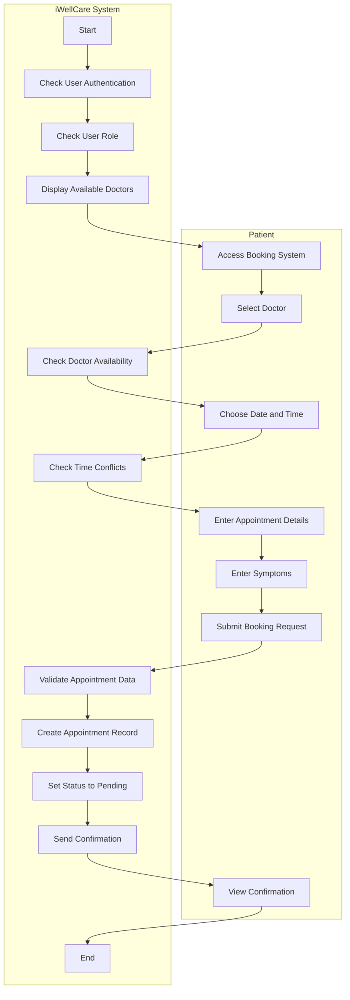
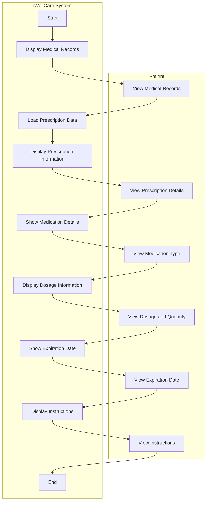
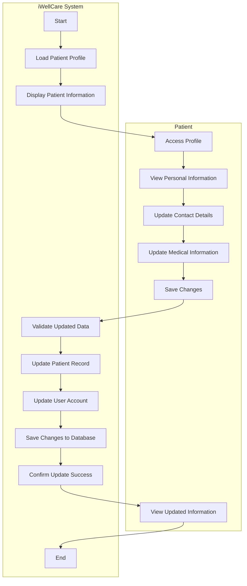
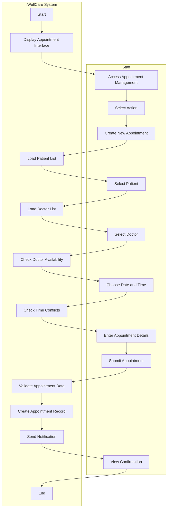
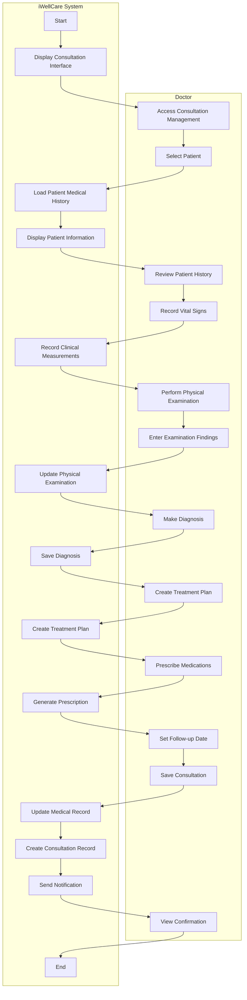
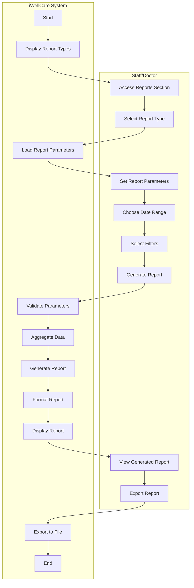

# iWellCare Healthcare Management System - Swimlane Activity Diagrams

## Overview
This document provides activity diagrams in the proper swimlane format, showing the interaction between Patient and iWellCare System, following the format shown in your example.

---

## 1. Activity Diagram for User Login Process

---

## 2. Activity Diagram for Patient Registration Process

---

## 3. Activity Diagram for Booking Appointment Process

---

## 4. Activity Diagram for Viewing Medical Records/Prescription

---

## 5. Activity Diagram for Managing Patient Information

---

## 6. Activity Diagram for Staff Managing Appointments

---

## 7. Activity Diagram for Doctor Managing Consultations

---

## 8. Activity Diagram for Viewing Reports

---

## Key Features of Swimlane Format:

### **✅ Proper Swimlane Structure:**
- **Left Lane**: Patient/User actions
- **Right Lane**: iWellCare System processes
- **Clear Separation**: Each actor has their own lane

### **✅ Flow Direction:**
- **Vertical Flow**: Top to bottom within each lane
- **Horizontal Transitions**: Between lanes when interaction occurs
- **Logical Sequence**: Each step follows logically from the previous

### **✅ Activity Nodes:**
- **Rectangular Boxes**: All activities are in rounded rectangles
- **Clear Labels**: Descriptive action names
- **Proper Naming**: Verb-noun format (e.g., "Enter Username", "Validate Credentials")

### **✅ Start and End Nodes:**
- **Start**: Solid circle in system lane
- **End**: Solid circle with outer ring in system lane
- **Consistent Placement**: Always in the system lane

### **✅ Interaction Flow:**
- **System Initiates**: System starts the process
- **User Responds**: User performs actions in response
- **System Processes**: System handles data and validation
- **User Confirms**: User views results or confirms actions

This swimlane format clearly shows the interaction between the Patient and the iWellCare System, making it easy to understand who does what and when in each process!
