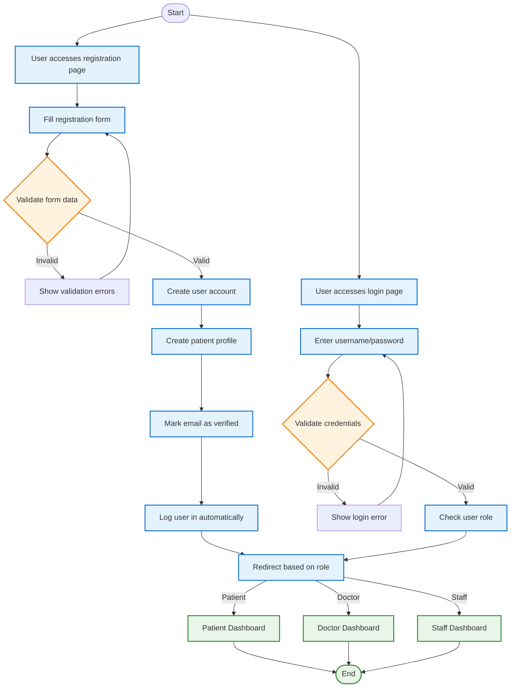
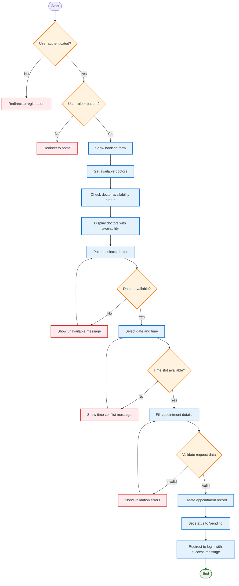
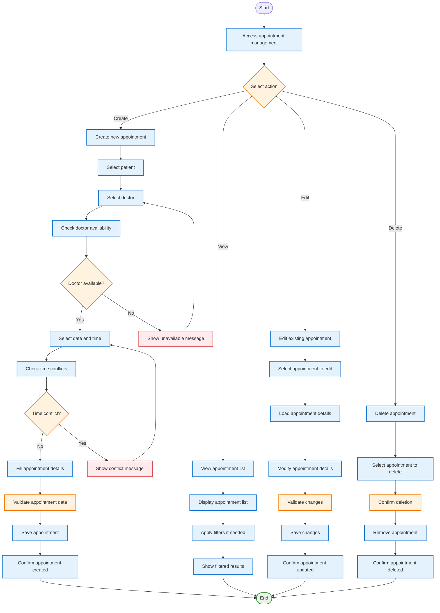
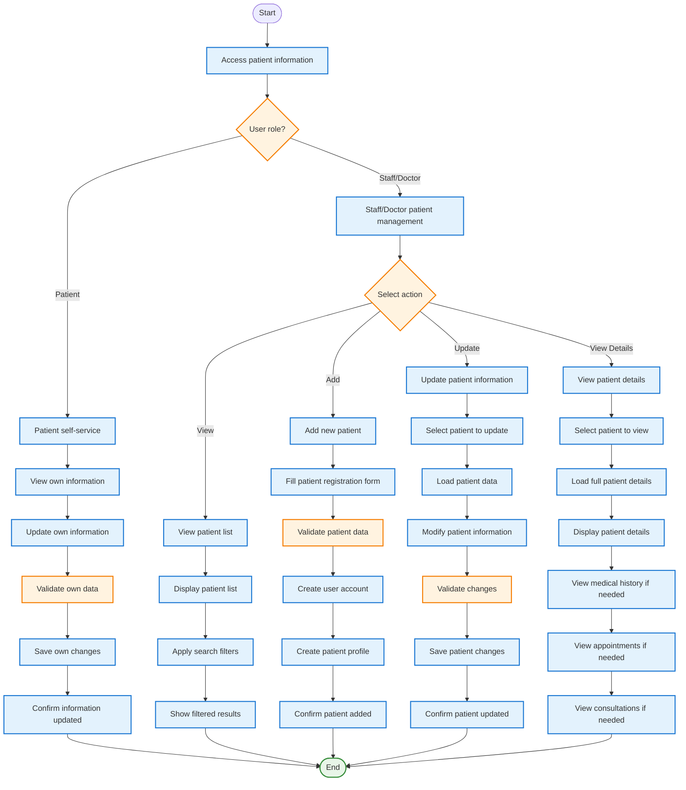
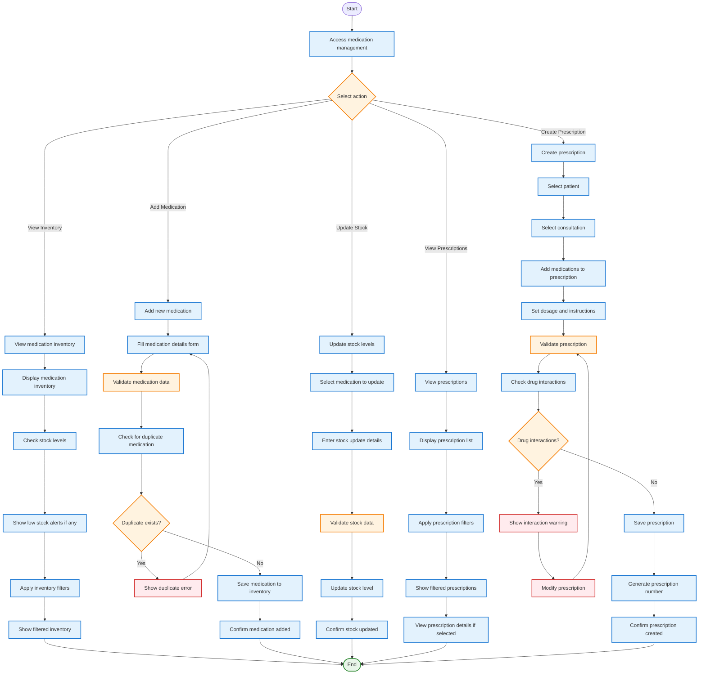
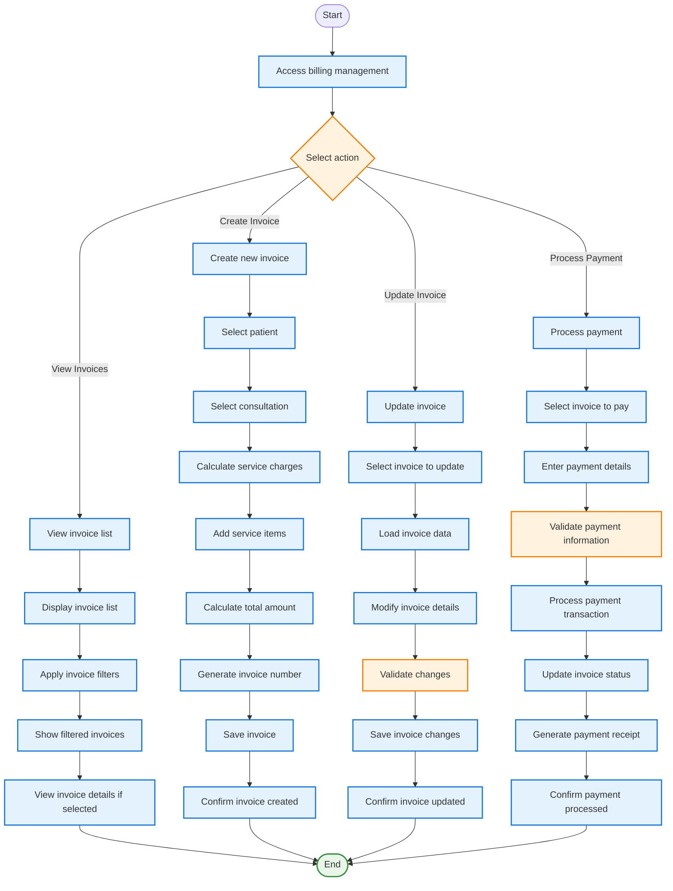

# iWellCare Healthcare Management System - Process-Based Activity Diagrams

## Overview
This document provides activity diagrams based on the actual system processes and use cases found in the iWellCare codebase. These diagrams reflect the real workflow implemented in the system.

## System Process Analysis

Based on the codebase analysis, the following key processes have been identified:

### 1. **User Registration & Authentication Process**
### 2. **Appointment Booking Process** 
### 3. **Consultation Management Process**
### 4. **Patient Information Management Process**
### 5. **Medication & Prescription Process**
### 6. **Invoice & Billing Process**

---

## 1. User Registration & Authentication Process

---

## 2. Appointment Booking Process (Patient)

---

## 3. Appointment Management Process (Staff/Doctor)

---

## 4. Consultation Management Process

```mermaid
graph TD
    Start([Start]) --> AccessConsultation[Access consultation management]
    AccessConsultation --> SelectAction{Select action}
    
    SelectAction -->|Start New| StartConsultation[Start new consultation]
    SelectAction -->|View| ViewConsultations[View consultation history]
    SelectAction -->|Update| UpdateConsultation[Update consultation]
    
    %% Start New Consultation Process
    StartConsultation --> SelectPatient[Select patient]
    SelectPatient --> SelectAppointment[Select appointment]
    SelectAppointment --> LoadPatientHistory[Load patient medical history]
    LoadPatientHistory --> EnterChiefComplaint[Enter chief complaint]
    EnterChiefComplaint --> EnterPresentIllness[Enter present illness]
    EnterPresentIllness --> EnterMedicalHistory[Enter past medical history]
    EnterMedicalHistory --> EnterFamilyHistory[Enter family history]
    EnterFamilyHistory --> EnterSocialHistory[Enter social history]
    
    EnterSocialHistory --> RecordVitalSigns[Record clinical measurements]
    RecordVitalSigns --> PerformPhysicalExam[Perform physical examination]
    PerformPhysicalExam --> EnterFindings[Enter physical examination findings]
    EnterFindings --> MakeDiagnosis[Make diagnosis]
    MakeDiagnosis --> CreateTreatmentPlan[Create treatment plan]
    CreateTreatmentPlan --> PrescribeMedication[Prescribe medications]
    PrescribeMedication --> SetFollowUp[Set follow-up date if needed]
    SetFollowUp --> AddConsultationNotes[Add consultation notes]
    AddConsultationNotes --> SaveConsultation[Save consultation record]
    SaveConsultation --> UpdateMedicalRecord[Update patient medical record]
    UpdateMedicalRecord --> CreatePrescription[Create prescription record]
    CreatePrescription --> ConfirmCompleted[Confirm consultation completed]
    
    %% View Consultations Process
    ViewConsultations --> DisplayList[Display consultation list]
    DisplayList --> ApplyFilters[Apply date/patient filters]
    ApplyFilters --> ShowResults[Show filtered consultations]
    ShowResults --> ViewDetails[View consultation details if selected]
    
    %% Update Consultation Process
    UpdateConsultation --> SelectConsultation[Select consultation to update]
    SelectConsultation --> LoadConsultation[Load consultation details]
    LoadConsultation --> ModifyDetails[Modify consultation details]
    ModifyDetails --> ValidateChanges[Validate changes]
    ValidateChanges --> SaveChanges[Save changes]
    SaveChanges --> UpdateRecords[Update related records]
    UpdateRecords --> ConfirmUpdated[Confirm consultation updated]
    
    ConfirmCompleted --> End([End])
    ViewDetails --> End
    ConfirmUpdated --> End
    
    %% Styling
    classDef process fill:#e3f2fd,stroke:#1976d2,stroke-width:2px
    classDef decision fill:#fff3e0,stroke:#f57c00,stroke-width:2px
    classDef endpoint fill:#e8f5e8,stroke:#388e3c,stroke-width:2px
    
    class AccessConsultation,StartConsultation,SelectPatient,SelectAppointment,LoadPatientHistory,EnterChiefComplaint,EnterPresentIllness,EnterMedicalHistory,EnterFamilyHistory,EnterSocialHistory,RecordVitalSigns,PerformPhysicalExam,EnterFindings,MakeDiagnosis,CreateTreatmentPlan,PrescribeMedication,SetFollowUp,AddConsultationNotes,SaveConsultation,UpdateMedicalRecord,CreatePrescription,ConfirmCompleted,ViewConsultations,DisplayList,ApplyFilters,ShowResults,ViewDetails,UpdateConsultation,SelectConsultation,LoadConsultation,ModifyDetails,ValidateChanges,SaveChanges,UpdateRecords,ConfirmUpdated process
    class SelectAction,ValidateChanges decision
    class End endpoint
```

---

## 5. Patient Information Management Process

---

## 6. Medication & Prescription Process

---

## 7. Invoice & Billing Process

---

## Use Case Relationships Summary

### **Include Relationships (Always Executed)**
- **Validate User Credentials** ← Login, Registration
- **Check User Role** ← All authenticated processes
- **Validate Doctor Availability** ← Appointment Booking, Appointment Management
- **Check Time Conflicts** ← Appointment Booking, Appointment Management
- **Validate Patient Data** ← Patient Information Management
- **Record Vital Signs** ← Consultation Management
- **Update Medical Record** ← Consultation Management
- **Check Drug Interactions** ← Prescription Management
- **Calculate Service Charges** ← Invoice Management

### **Extend Relationships (Optional Features)**
- **Reschedule Appointment** → Appointment Management
- **Cancel Appointment** → Appointment Management
- **Schedule Follow-up** → Consultation Management
- **Create Referral** → Consultation Management
- **Export Reports** → All Management Processes
- **Send Notifications** → All Processes
- **Print Prescription** → Prescription Management
- **Generate Receipt** → Invoice Management

### **System Process Flow**
1. **Authentication** → Role-based access control
2. **Data Validation** → Input validation and error handling
3. **Database Operations** → Create, Read, Update, Delete operations
4. **Business Logic** → Application-specific processing
5. **User Feedback** → Confirmation messages and error handling
6. **Session Management** → User session handling

These activity diagrams reflect the actual system processes implemented in the iWellCare Healthcare Management System, showing the real workflow from user interaction to database operations.
