# iWellCare Healthcare Management System - Use Case Diagram

```mermaid
graph TD
    %% Actors positioned like in the reference image
    Doctor((Doctor))
    Staff((Staff))
    Patient((Patient))

    %% System boundary - rectangular box
    subgraph "iWellCare Healthcare Management System"
        %% Main Use Cases (accessible by Doctor and Staff)
        UC1[Login]
        UC2[Manage Patients Information]
        UC3[Manage Invoice]
        UC4[Manage Consultation]
        UC5[Manage Medication]
        UC6[Manage User]
        UC7[Generate Reports]
        UC8[Logout]

        %% Sub-Use Cases (extensions)
        UC9[Add]
        UC10[View]
        UC11[Update]

        %% Patient-specific Use Cases
        UC12[Sign up]
        UC13[Book Appointment]
    end

    %% Doctor relationships
    Doctor --> UC1
    Doctor --> UC2
    Doctor --> UC3
    Doctor --> UC4
    Doctor --> UC5
    Doctor --> UC6
    Doctor --> UC7
    Doctor --> UC8

    %% Staff relationships
    Staff --> UC1
    Staff --> UC2
    Staff --> UC3
    Staff --> UC4
    Staff --> UC5
    Staff --> UC6
    Staff --> UC7
    Staff --> UC8

    %% Patient relationships
    Patient --> UC1
    Patient --> UC2
    Patient --> UC12
    Patient --> UC13

    %% Extend relationships for Doctor
    UC2 -.->|<<extend>>| UC9
    UC2 -.->|<<extend>>| UC10
    UC2 -.->|<<extend>>| UC11
    UC3 -.->|<<extend>>| UC9
    UC3 -.->|<<extend>>| UC10
    UC3 -.->|<<extend>>| UC11
    UC4 -.->|<<extend>>| UC10
    UC4 -.->|<<extend>>| UC11
    UC5 -.->|<<extend>>| UC9
    UC5 -.->|<<extend>>| UC10
    UC5 -.->|<<extend>>| UC11
    UC6 -.->|<<extend>>| UC9
    UC6 -.->|<<extend>>| UC10
    UC6 -.->|<<extend>>| UC11

    %% Extend relationships for Staff
    UC2 -.->|<<extend>>| UC9
    UC2 -.->|<<extend>>| UC10
    UC2 -.->|<<extend>>| UC11
    UC3 -.->|<<extend>>| UC10
    UC3 -.->|<<extend>>| UC11
    UC4 -.->|<<extend>>| UC10
    UC4 -.->|<<extend>>| UC11
    UC5 -.->|<<extend>>| UC9
    UC5 -.->|<<extend>>| UC10
    UC5 -.->|<<extend>>| UC11
    UC6 -.->|<<extend>>| UC9
    UC6 -.->|<<extend>>| UC10
    UC6 -.->|<<extend>>| UC11

    %% Include relationship for Patient
    UC12 -.->|<<include>>| UC1

    %% Extend relationship for Patient
    UC2 -.->|<<extend>>| UC9

    %% Styling
    classDef actorStyle fill:#e1f5fe,stroke:#01579b,stroke-width:2px
    classDef useCaseStyle fill:#f3e5f5,stroke:#4a148c,stroke-width:1px
    classDef extendStyle stroke:#ff6b6b,stroke-dasharray: 5 5
    classDef includeStyle stroke:#4ecdc4,stroke-dasharray: 5 5

    class Doctor,Staff,Patient actorStyle
    class UC1,UC2,UC3,UC4,UC5,UC6,UC7,UC8,UC9,UC10,UC11,UC12,UC13 useCaseStyle
```

## Use Case Descriptions

### Main Use Cases (Doctor & Staff)
- **Login**: Authenticate user with credentials
- **Manage Patients Information**: Handle patient registration and records
- **Manage Invoice**: Process billing and invoicing
- **Manage Consultation**: Oversee consultation process
- **Manage Medication**: Handle prescription and medication management
- **Manage User**: Manage system users and permissions
- **Generate Reports**: Create various system reports
- **Logout**: End user session

### Sub-Use Cases (Extensions)
- **Add**: Create new records
- **View**: Display existing records
- **Update**: Modify existing records

### Patient-Specific Use Cases
- **Sign up**: Register new patient account
- **Book Appointment**: Schedule new appointment

### Relationships
- **Extend Relationships**: Sub-use cases extend main use cases with optional functionality
- **Include Relationships**: Sign up includes Login functionality
- **Direct Associations**: Actors directly interact with main use cases 